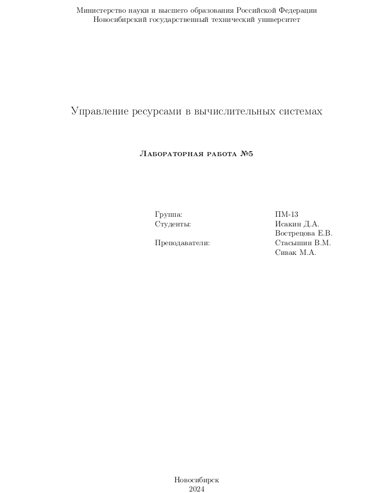

<style>
.a4-container {
  width: 210mm;
  height: 297mm;
  margin: auto; /* для центровки страницы */
  page-break-after: always; /* для начала следующего элемента с новой страницы */
}

.img_all_div
{
    width: 100%;
    height: 100%;
    object-fit: cover;	
}
</style>

<div class="a4-container" markdown=1>



</div>

<div class="a4-container" markdown=1>

# 1. Условие (Вариант №10)
Программа моделирует работу монитора обработки сообщений. Порожденные процессы, обладающие различными приоритетами и выполняющие некоторые циклы работ, посредством очереди сообщений передают родительскому процессу имена программ из предыдущих лабораторных работ, которые им должны быть запущены. Родительский процесс, обрабатывая сообщения в соответствии с их приоритетами, следит, чтобы одновременно было запущено не более трех программ.

# 2. Анализ задачи

1. Организовать очередь сообщений и последовательно (в соответсвии с приоритетом) внести в эту очередь цикл задач для выполнения
   - Упарвление будет происходить при помощи сигналов и сегмета разделяемой памяти. 
2. Организовать цикл в котором будет осуществляться цикл работ. Данные для запуска берутся из очереди сообщений.
   - Для корректной работы предусмотреть возможность захвата ресурсов (очередь сообщений) по средствам семафора. 
3. В родительском процессе ждать завершения дочерних процессов. При этом родительские процесс контролирует, что бы не было запущено больше 3-х процессов.  

</div>

<div class="a4-container" markdown=1>

# 3.Используемые програмные средства

---

- `int fork ();` - порождение процессапотомка
- `int waitpid ( pid_t pid , int * status , NULL );` - ожидание завершения процессапотомка
- `int getpid ();` - определение pid текущего процесса
- `int getppid ();` - определение процесса родителя
- `int sleep( int seconds );` - остановка процесса на n секунд
- `void (*signal (int signal, void (*sigfunc) (int func)))(int)` - устанавливает обработчик сигнала на signal
-  `int shmget(key_t key, int size, int shmflg);` - возвращает идентификатор разделяемому сегменту памяти
-  ` void *shmat(int shmid, const void *shmaddr, int shmflg);` - Функция shmat подстыковывает сегмент разделяемой памяти shmid к адресному пространству вызывающего процесса
-  `int msgget(key_t key, int msgflg);` - Эта функция возвращает идентификатор очереди сообщений, связанный со значением параметра key 
-  ` int msgsnd(int msqid, struct msgbuf *msgp, size_t msgsz, int msgflg);` - отпраляет сообщение в очередь сообщений
-  ` int semop(int semid, struct sembuf *sops, unsigned nsops);` - Функция производит операции над выбранными элементами из набора семафоров semid.
-  ` int msgsnd(int msqid, struct msgbuf *msgp, size_t msgsz, int msgflg);` - получить сообщение из очереди сообщений
-  ` int shmdt(const void *shmaddr);` - Функция shmdt отстыковывает сегмент разделяемой памяти, находящийся по адресу shmaddr
-  ` int shmctl(int shmid, int cmd, struct shmid_ds *buf);` - shmctl() позволяет пользователю получать информацию о разделяемых сегментах памяти, устанавливать владельца, группу разделяемого сегмента, права на него; эта функция может также удалить сегмент
-  ` int msgctl(int msqid, int cmd, struct msqid_ds *buf);` - Эта функция выполняет контрольную операцию, заданную в cmd, над очередью сообщений msqid.
-  `int semctl(int semid, int semnum, int cmd, ...);` - Функция semctl позволяет выполнять операции, определенные в cmd над набором семафоров, указанным в semid или над семафором с номером semnum из этого набора.
---

</div>


<div class="a4-container" markdown=1>

# 4.Спецификация

- Программа находится в папке  /lab5
- Чтобы собрать программу нужно ввести make
- Чтобы запустить программу, нужно использовать команду "./main"
- В результате работы программы, будут выводиться pid процессов, которые которые запускают программы из цикла работ 

# 5. Результат работы программы

---

```
Proc pid = 107891 Load was end
Proc pid = 107892 Load was end
Proc pid = 107891 was end
proc pid = 107892 was end
pid1 = 107894: lab1
pid2 = 107895: lab2
pid3 = 107896: lab3
pid = 107894 Work lab1
pid = 107895 Work lab2
pid = 107896 Work lab3
pid1 = 108147: lab4
pid2 = 108148: lab5
pid3 = 108149: lab1
pid = 108148 Work lab5
pid = 108149 Work lab1
pid = 108147 Work lab4
pid1 = 109373: lab1
pid2 = 109374: lab2
pid3 = 109375: lab3
pid = 109374 Work lab2
pid = 109373 Work lab1
pid = 109375 Work lab3
pid1 = 109379: lab4
pid2 = 109380: lab5
pid3 = 109381: lab1
pid = 109380 Work lab5
pid = 109381 Work lab1
pid = 109379 Work lab4
```

---

</div>

# 6. Исходный код

**main.c**
```c
#include <stdio.h>
#include <sys/types.h> // pid_t
#include <unistd.h>    // fork(), sleep(), usleep()
#include <stdlib.h>    // fprintf(), fscanf()
#include <inttypes.h>
#include <sys/resource.h>
#include <sys/wait.h>   // waitpid
#include <sys/signal.h> // signal, kill
#include <string.h>

#include <sys/types.h>
#include <sys/ipc.h>
#include <sys/shm.h>
#include <sys/msg.h>
#include <sys/sem.h>

#define PID_POOL 100
#define MAX_CURR_PID 3
#define MSG_BUFFER_SIZE 256
#define DELAY_TIME 1000 // Время сна перед очередной проверкой для процесса
#define SHM_KEY 101
#define MSG_KEY 16
#define SEM_KEY 1235
#define BREAK_PROC 2
#define LOAD_PROC_CYCLE_WORK_TO_QUEUE 1

pid_t pidPool[PID_POOL];     // Массив идентификаторов процесса
pid_t currPid[MAX_CURR_PID]; // Массив максимального количества одновременно запущенных программ

/* Структура управления действиями процесса */
typedef struct _pidCommand
{
    int32_t type_action; // Тип действия 0 - ничего не делать, 1 - загрузить данные из очереди, 2 - завершить процесс
    pid_t pid;           // Процесс которому предназначено действие
    int32_t CanSend;     //  Можно ли отправлять запрос
} PidCommand;

typedef struct _msg_buf
{
    long mtype;
    char mtext[MSG_BUFFER_SIZE];
} MsgBuf;

PidCommand *pid_command;

void alarm_handler(int sig) {} // Функция пустышка для пробуждения процесса

void send_proc_command(pid_t pid, int32_t action_type)
{
    // printf("set pid = %d, type = %d\n", pid, action_type);
    while (pid_command->pid != pid)
        pid_command->pid = pid;
    while (pid_command->type_action != action_type)
        pid_command->type_action = action_type;
    while (pid_command->CanSend != 0)
        pid_command->CanSend = 0;
    while (kill(pid, SIGALRM))
        ;
    while (pid_command->CanSend == 0)
        ;
}


int main()
{
    pid_t parentpid = getpid();
    /* Создаем набор из 1 семафора */
    int sem_id = semget(SEM_KEY, 1, IPC_CREAT | 0666);
    if(sem_id == -1)
    {
        perror("semget");
        exit(EXIT_FAILURE);
    }

    // Инициализация семафора начальным значением 1
    union semun
    {
        int val;
        struct semid_ds  *bug;
        unsigned short *array;
        
    }sem_union;
    sem_union.val = 1;
    if(semctl(sem_id, 0, SETVAL, sem_union) == -1)
    {
        perror("semctl");
        exit(EXIT_FAILURE);
    }


    // Переопределить поведение сигнала
    signal(SIGALRM, alarm_handler);

    /* Создать сегмент разделаемой памяти */
    int shm_id = shmget(SHM_KEY, sizeof(PidCommand), IPC_CREAT | 0666);
    if (shm_id == -1)
    {
        perror("shmget");
        exit(EXIT_FAILURE);
    }

    // Присоединяем сегмент разделаемой памяти к своему адресному пространству
    void *shm_addr = shmat(shm_id, NULL, 0);
    if (shm_addr == (void *)-1)
    {
        perror("shmat");
        exit(EXIT_FAILURE);
    }

    /* Создадим очередь сообщений */
    int32_t msgid = msgget(MSG_KEY, IPC_CREAT | 0666);
    if (msgid == -1)
    {
        perror("msgget");
        exit(EXIT_FAILURE);
    }
    pid_command = (PidCommand *)shm_addr;

    if ((pidPool[0] = fork()) == 0)
    {
        // Цикл процесса
        const int SIZE = 6;
        char *CycleWork[6] = {"lab1", "lab2", "lab3", "lab4", "lab5", "lab1"};

        while (1)
        {
            // printf("cycle....");
            // printf("pid = %d action = %d\n", pid_command->pid, pid_command->type_action);

            if (pid_command->pid == getpid())
            {
                if (pid_command->type_action == 1)
                {
                    for (int i = 0; i < SIZE; i++)
                    {
                        MsgBuf msg;
                        msg.mtype = 1;
                        strcpy(msg.mtext, CycleWork[i]);
                        if (msgsnd(msgid, &msg, sizeof(msg.mtext), 1) == -1)
                        {
                            perror("msgsnd");
                            exit(EXIT_FAILURE);
                        }

                        usleep(500);
                    }
                    printf("Proc pid = %d Load was end\n", getpid());
                    /* Подъем флага синхронизации */
                    while (pid_command->CanSend == 0)
                        pid_command->CanSend = 1;
                }
                else if (pid_command->type_action == 2)
                {
                    printf("Proc pid = %d was end\n", getpid());
                    while (pid_command->CanSend == 0)
                        pid_command->CanSend = 1;
                    break;
                }
            }
            sleep(DELAY_TIME); // Сон, не поедаем процессорное время. Раз в 1000сек смотрим не изменилось ли состояние и не пора ли нам чего то сделать
        }
    }
    else if (pidPool[0] < 0)
    {

        perror("Fork error\n");
        exit(-1);
    }

    if ((pidPool[1] = fork()) == 0)
    {
        // Цикл процесса
        const int SIZE = 6;
        char *CycleWork[6] = {"lab1", "lab2", "lab3", "lab4", "lab5", "lab1"};

        // Цикл процесса
        while (1)
        {
            // printf("cycle....");
            // printf("pid = %d action = %d\n", pid_command->pid, pid_command->type_action);

            if (pid_command->pid == getpid())
            {
                if (pid_command->type_action == 1)
                {
                    for (int i = 0; i < SIZE; i++)
                    {
                        MsgBuf msg;
                        msg.mtype = 1;
                        strcpy(msg.mtext, CycleWork[i]);
                        if (msgsnd(msgid, &msg, sizeof(msg.mtext), 1) == -1)
                        {
                            perror("msgsnd");
                            exit(EXIT_FAILURE);
                        }
                        usleep(500);
                    }
                    printf("Proc pid = %d Load was end\n", getpid());
                    /* Подъем флага синхронизации */
                    while (pid_command->CanSend == 0)
                        pid_command->CanSend = 1;
                }
                else if (pid_command->type_action == 2)
                {
                    printf("proc pid = %d was end\n", getpid());
                    while (pid_command->CanSend == 0)
                        pid_command->CanSend = 1;
                    break;
                }
            }
            sleep(DELAY_TIME); // Сон, не поедаем процессорное время. Раз в 1000сек смотрим не изменилось ли состояние и не пора ли нам чего то сделать
        }
    }
    else if (pidPool[1] < 0)
    {

        perror("Fork error\n");
        exit(-1);
    }

    /* Основной цикл работ */
    /* Загружаем в очередь весь список для выполнения */

    if (pidPool[0] != 0 && pidPool[1] != 0)
    {

        send_proc_command(pidPool[0], LOAD_PROC_CYCLE_WORK_TO_QUEUE);
        send_proc_command(pidPool[1], LOAD_PROC_CYCLE_WORK_TO_QUEUE);
        /* Завершаем процессы */
        send_proc_command(pidPool[0], BREAK_PROC);
        send_proc_command(pidPool[1], BREAK_PROC);

        /* Выполняем все программы из очереди */
        /*всего их в очереди 10 штук поэтому загружем ровно 10 штук*/

        int prog_cnt = 12;

        while (prog_cnt > 0)
        {
            /* Создадим 3 процесса для выполнения программы */
            pid_t pid1;
            pid_t pid2;
            pid_t pid3;

            if((pid1 = fork()) == 0)
            {
                /*  Захват семафора */
                struct sembuf sem_op;
                sem_op.sem_num = 0;
                sem_op.sem_op = -1;
                sem_op.sem_flg = 0;
                if(semop(sem_id, &sem_op, 1) == -1)
                {
                    perror("semop");
                    exit(EXIT_FAILURE);
                }
                /* Критическая секция */

                /* Извлекаем данные из очереди */
                MsgBuf msg;
                if (msgrcv(msgid, &msg, MSG_BUFFER_SIZE, 1, 0) == -1)
                {
                    perror("msgrcv");
                    exit(EXIT_FAILURE);
                }
                
                /* Освободить семафор */
                sem_op.sem_op = 1;
                if(semop(sem_id, &sem_op, 1) == -1)
                {
                    perror("semop");
                    exit(EXIT_FAILURE);
                }

                printf("pid1 = %d: %s\n",getpid(),msg.mtext); 
                if(execl(msg.mtext, "", NULL) == -1)
                {
                    perror("execl");
                    exit(EXIT_FAILURE);
                }

                exit(EXIT_SUCCESS);
            }
            else if((pid2 = fork()) == 0 && pid1 > 0)
            {
                /*  Захват семафора */
                struct sembuf sem_op;
                sem_op.sem_num = 0;
                sem_op.sem_op = -1;
                sem_op.sem_flg = 0;
                if(semop(sem_id, &sem_op, 1) == -1)
                {
                    perror("semop");
                    exit(EXIT_FAILURE);
                }

                /* Критическая секция */

                /* Извлекаем данные из очереди */
                MsgBuf msg;
                if (msgrcv(msgid, &msg, MSG_BUFFER_SIZE, 1, 0) == -1)
                {
                    perror("msgrcv");
                    exit(EXIT_FAILURE);
                }
                /* Освободить семафор */
                sem_op.sem_op = 1;
                if(semop(sem_id, &sem_op, 1) == -1)
                {
                    perror("semop");
                    exit(EXIT_FAILURE);
                }

               printf("pid2 = %d: %s\n",getpid(),msg.mtext); 
                if(execl(msg.mtext, "", NULL) == -1)
                {
                    perror("execl");
                    exit(EXIT_FAILURE);
                }

                exit(EXIT_SUCCESS);
            }
            else if((pid3 = fork()) == 0 && pid1 > 0 && pid2 > 0)
            {
                /*  Захват семафора */
                struct sembuf sem_op;
                sem_op.sem_num = 0;
                sem_op.sem_op = -1;
                sem_op.sem_flg = 0;
                if(semop(sem_id, &sem_op, 1) == -1)
                {
                    perror("semop");
                    exit(EXIT_FAILURE);
                }

                /* Критическая секция */

                /* Извлекаем данные из очереди */
                MsgBuf msg;
                if (msgrcv(msgid, &msg, MSG_BUFFER_SIZE, 1, 0) == -1)
                {
                    perror("msgrcv");
                    exit(EXIT_FAILURE);
                }
                
                /* Освободить семафор */
                sem_op.sem_op = 1;
                if(semop(sem_id, &sem_op, 1) == -1)
                {
                    perror("semop");
                    exit(EXIT_FAILURE);
                }


               printf("pid3 = %d: %s\n",getpid(),msg.mtext); 
                if(execl(msg.mtext, "", NULL) == -1)
                {
                    perror("execl");
                    exit(EXIT_FAILURE);
                }

                exit(EXIT_SUCCESS);
            }
            else if(pid1 > 0 && pid2 > 0 && pid3 > 0)
            {
                int status;
                //printf("Parentpid  ");
                //printf("pid1 = %d  pid2 = %d\n", pid1, pid2); 

                if(waitpid(pid1, &status, 0) == pid1)
                { 
                    //printf("status pid1 = %d\n", status);
                    prog_cnt--;
                }
           
                if(waitpid(pid2, &status, 0) == pid2)
                {
                    //printf("status pid2 = %d\n", status);
                    prog_cnt--;
                } 

                if(waitpid(pid3, &status, 0) == pid3)
                {
                    prog_cnt--;
                }
                    
               //printf("prog_cnt: %d\n", prog_cnt);
            
            }
            else 
            {
                perror("fork");
                exit(EXIT_FAILURE);
            }

            //prog_cnt--;
        }

        waitpid(pidPool[0], NULL, 0);
        waitpid(pidPool[1], NULL, 0);

        // Отсоединить сегмент разделяемой памяти от своего адресного пространства
        if (shmdt(shm_addr) == -1)
        {
            perror("shmdt");
            exit(EXIT_FAILURE);
        }

        // Удалить сегмент разделяемой памяти
        if (shmctl(shm_id, IPC_RMID, NULL) == -1)
        {
            perror("shmctl");
            exit(EXIT_FAILURE);
        }

        /* Закрыть очередь сообщений */
        if (msgctl(msgid, IPC_RMID, NULL) == -1)
        {
            perror("msgctl");
            exit(EXIT_FAILURE);
        }

        /* Удалить набор семафоров */
        if(semctl(sem_id, 0, IPC_RMID) == -1)
        {
            perror("semctl");
            exit(EXIT_FAILURE);
        }
    }

    return EXIT_SUCCESS;
}


```

**makefile**
```makefile

# Makefile for lab #5
all: main

main: main.o
	gcc main.o -o main
	
lab1: lab1.o
	gcc lab1.o -o lab1

lab2: lab2.o
	gcc lab2.o -o lab2

lab3: lab3.o
	gcc lab3.o -o lab3

lab4: lab4.o
	gcc lab4.o -o lab4

lab5: lab5.o
	gcc lab5.o -o lab5


main.o: main.c
	gcc -c main.c

lab1.o: lab1.c
	gcc  -c lab1.c

lab2.o: lab2.c
	gcc  -c lab2.c

lab3.o: lab3.c
	gcc  -c lab3.c

lab4.o: lab4.c
	gcc  -c lab4.c

lab5.o: lab5.c
	gcc  -c lab5.c


clean:
	rm -rf *.o main

```


